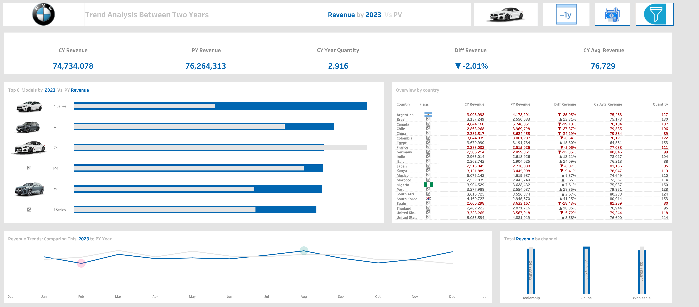

# Tableau-Projects

### [Optimizing HPN Operations: A Deep Dive into Sales, Profit, Quantity and Order Performance](https://public.tableau.com/app/profile/ahmed.hegazy/viz/HPN_Project/Sales)

This dashboard provides a comprehensive overview of HPN sales and profit performance, analyzing key metrics like total sales, profit, quantity, and category-level trends. It includes visualizations such as maps, bar charts, line charts, and scatter plots to illustrate geographic distribution, year-over-year growth, customer segmentation, and product performance.

**Insights and Actionable Recommendations:**

- Geographic Focus: The map highlights sales and profit distribution across regions. Identify high-potential areas for expansion and target marketing efforts.
- Product Performance: Analyze the bar chart to identify top-performing categories and products. Focus on promoting and optimizing these products.
- Customer Segmentation: The scatter plot reveals distinct customer segments based on sales and profit. Tailor marketing and pricing strategies to target these segments effectively.
- Year-over-Year Growth: The line chart shows overall growth trends. Identify areas where growth is stagnant or declining and investigate underlying causes.
- Seasonal Patterns: Analyze the bar chart for seasonal variations in sales and profit. Adjust inventory levels and marketing campaigns accordingly.
- Customer Loyalty: The bubble chart provides insights into customer loyalty and purchasing behavior. Reward repeat customers and identify opportunities for upselling.
- Discount Effectiveness: Evaluate the scatter plot to assess the impact of discounts on profit. Optimize discount strategies to maximize profitability.
- Product Portfolio: Analyze the bar chart to identify low-performing products. Consider discontinuing or revamping them.
- Resource Allocation: Allocate resources to categories with the highest growth potential and profitability.
- Continuous Monitoring: Regularly review the dashboard to track performance, identify trends, and make data-driven decisions.
- Order fulfillment: Evaluate order fulfillment metrics to identify areas for improvement and optimize the customer experience.
  
 **Based on these insights, you can implement strategies such as:**

- Prioritize high-demand products: Increase inventory levels and optimize product placement.
- Target high-value customers: Offer personalized promotions and exclusive deals to retain and upsell to these customers.
- Improve order fulfillment processes: Streamline operations, reduce lead times, and enhance customer satisfaction.

               

--------------
### [BMW Car Sales Dashboar](https://public.tableau.com/app/profile/ahmed.hegazy/viz/Book1_17247314164760/BigPicture) | [ViZ](https://public.tableau.com/app/profile/ahmed.hegazy/viz/Book1_17247314164760/BigPicture) | [Exploration](https://view.officeapps.live.com/op/view.aspx?src=https%3A%2F%2Fraw.githubusercontent.com%2FAhmedHegazy121%2FportfolioProjects%2Fmain%2FExploration.pptx&wdOrigin=BROWSELINK)

I have worked on three dynamic and interactive dashboards for BMW. The first one provides an overview of the annual revenue, highlighting the year with the highest revenue. 
The second dashboard offers an interactive comparison of the current year’s revenue with the previous year, allowing users to explore the differences. 
The third dashboard dives deep into each BMW model, offering detailed and interactive insights into every single model. All these dashboards are designed to be highly dynamic and user-friendly.

**What are the Key Insights that we could focus on to provide Valuable Information**
- Revenue Trends
- Top-Selling Models
- Sales Performance by Country
- Sales Channel Performance
- Quantity Sold
- Year over Year Analysis

-----------------

### [Comprehensive Trend and Variance Analysis of Copier Sales with Sub-Category Performance Comparison](https://public.tableau.com/app/profile/ahmed.hegazy/viz/spirkline/Currentyearsale)

**Tasks :**

 ✔ Comprehensive sales, profit and Discount trend analysis across all years.
 
✔ We will perform a trend analysis by calculating this year's sales.

✔ Calculation of this year's sales, along with the variance analysis across sub-categories.

✔ We will focus exclusively on the sub-category "Copiers" and calculate the difference in performance across the entire dataset.

✔ We will perform a trend analysis by calculating this year's profit.

✔ Calculation of this year's profit , along with the variance analysis across sub-categories.

✔ We will focus exclusively on the sub-category "Copiers" 

✔ NR. of Customers Distrubtion Across Number of Oreder.

✔ Calculation of this year's Orders , along with the variance analysis across sub-categories.

✔ We will focus exclusively on the sub-category "Copiers" 

✔ We will perform a trend analysis by calculating this year's quantity.

✔ Calculation of this year's quantity, along with the variance analysis across sub-categories.

✔ We will focus exclusively on the sub-category "Copiers" and calculate the difference in performance across the entire dataset.

              

------------

### **[Case Study: How Does a Bike-Share Navigate Speedy Success Dashboard](https://public.tableau.com/views/CaseStudyHowDoesaBike-ShareNavigateSpeedySuccess_17228246429470/Dashboard1?:language=en-US&:sid=&:redirect=auth&:display_count=n&:origin=viz_share_link)**  | [Link](https://public.tableau.com/views/CaseStudyHowDoesaBike-ShareNavigateSpeedySuccess_17228246429470/Dashboard1?:showVizHome=no)

How do annual members and casual riders use Cyclistic bikes differently?

***To answer these questions, we will delve into the following topics:**

- Duration and frequency of rides: We will analyze data to understand the typical length of rides for both user groups. Are there noticeable differences between casual riders and members? Are members using the bikes more frequently or for longer duration?

- Ride timings: We’ll investigate if there’s a difference in the time of day, day of the week, or month of the year when the two user groups typically use the bikes.

- Bike preferences: Given that Cyclistic offers various bike options, we will examine if there’s a pattern in the type of bike preferred by the two user groups.

Answering these questions will provide insights into the riding patterns of the two groups (annual member and casual renters), and will be instrumental in forming the foundation for a marketing strategy aimed at converting casual riders into annual members. The strategy will be developed in alignment with these insights, addressing the unique needs and behaviors of casual riders to motivate their transition to becoming annual members.

Cyclistic’s collected data forms the backbone of this analysis. For transparency, we have included the source code in the paper’s Appendix. We strive to communicate our findings clearly, pairing concise language with comprehensible visualizations and straightforward recommendations.

---------

### [Sales Performance Dashboard](https://www.linkedin.com/posts/hegazy-ahmed_sales-dashboard-activity-7222760336511107072-B8-r?utm_source=share&utm_medium=member_desktop) | [Video](https://www.linkedin.com/posts/hegazy-ahmed_dataanalysis-tableau-salesdashboard-activity-7220992076723720193-jkez?utm_source=share&utm_medium=member_desktop) | [persentation](https://www.linkedin.com/posts/hegazy-ahmed_sales-dashboard-activity-7222760336511107072-B8-r?utm_source=share&utm_medium=member_desktop) 

The purpose of sales dashboard is to present an overview of the sales metrics and trends in order to analyze year-over-year sales performance and understand sales trends.
The customer dashboard aims to provide an overview of customer data, trends and behaviors. It will help marketing teams and management to understand customer segments and improve customer satisfaction.
Key Requirements
KPI Overview
Display a summary of total sales, profits and quantity for the current year and the previous year.
Sales Trends

 – Present the data for each KPI on a monthly basis for both the current year and the previous year.
 – Identify months with highest and lowest sales and make them easy to recognize.
Product Subcategory Comparison

 – Compare sales performance by different product subcategories for the current year and the previous year.
 – Include a comparison of sales with profit.
Weekly Trends for Sales & Profit

 – Present weekly sales and profit data for the current year.
 – Display the average weekly values.
 – Highlight weeks that are above and below the average to draw attention to sales & profit performance.
 Customer Trends
 
 – Present the data for each KPI on a monthly basis for both the current year and the previous year.
 – Identify months with highest and lowest sales and make them easy to recognize.
Customer Distribution by Number of Orders
Represent the distribution of customers based on the number of orders they have placed to provide insights into customer behavior, loyalty and engagement.
Top 10 Customers By Profit

 – Present the top 10 customers who have generated the highest profits for the company.
 – Show additional information like rank, number of orders, current sales, current profit and the last order date.

------
#### COVID-19 in India Dashboard

This dashboard provides a comprehensive overview of the COVID-19 situation in India, including key metrics, trends, and visualizations.

#### Dashboard Overview
- **Creator**: Ahmed Hegazy
- **Platform**: Tableau Public
- **Link**: [COVID-19 in India Dashboard](https://public.tableau.com/app/profile/ahmed.hegazy/viz/Covid-19inIndiaDashboard_17349784871950/Dashboard1)

#### Key Metrics
- **Total Cases**: [Insert Total Cases]
- **Total Deaths**: [Insert Total Deaths]
- **Total Recoveries**: [Insert Total Recoveries]
- **Active Cases**: [Insert Active Cases]
- **Vaccination Coverage**: [Insert Vaccination Coverage]

#### Visualizations
1. **Cases Over Time**:
   - Line chart showing the progression of COVID-19 cases over time.
   
2. **Deaths Over Time**:
   - Line chart illustrating the number of deaths over time.

3. **Recoveries Over Time**:
   - Line chart depicting the number of recoveries over time.

4. **Geographical Distribution**:
   - Map showing the distribution of cases across different states in India.

5. **Vaccination Progress**:
   - Bar chart or line chart showing the progress of vaccination campaigns.

6. **Demographic Analysis**:
   - Pie charts or bar graphs showing the distribution of cases by age group, gender, or other demographics.

#### Insights
- **Trend Analysis**: The dashboard highlights the trends in cases, deaths, and recoveries, providing insights into the progression of the pandemic.
- **Geographical Hotspots**: Identifies states with the highest number of cases and deaths.
- **Vaccination Impact**: Shows the correlation between vaccination rates and the reduction in cases or severity.

#### Usage
This dashboard can be used by policymakers, healthcare professionals, and the general public to understand the COVID-19 situation in India and make informed decisions.

#### How to Access
- Visit the Tableau Public profile of Ahmed Hegazy.
- Navigate to the "COVID-19 in India Dashboard" to interact with the visualizations and explore the data in detail.

#### Contributing
If you have additional data or suggestions for improving the dashboard, please contact the creator through Tableau Public.

------
###  [Break Down between Female and Male Dashboard ](https://public.tableau.com/app/profile/ahmed.hegazy/viz/BreakdownbetweenMandF/Dashboard1) | **[Link to VIZ ](https://public.tableau.com/app/profile/ahmed.hegazy/viz/BreakdownbetweenMandF/Dashboard1)**
**Key Responsibilities:**

-Employee Gender Breakdown (1990-Present):

-Analyzed employee distribution by gender over the years using SQL.
Departmental Gender Comparison:

-Compared male and female employee distribution across departments over time.
Average Salary Analysis by Gender:

-Calculated and compared average salaries of male and female employees by department.
Salary Range Analysis (50,000 - 90,000):

-Developed a stored procedure to analyze average salaries within a specified range by gender and department.
Technologies Used: SQL, Stored Procedures

Outcome: Provided valuable insights into gender distribution, departmental trends, and salary equity, aiding HR in informed decision-making.

----

### [Amazon Prime Video - Movies and TV Shows](https://public.tableau.com/app/profile/ahmed.hegazy/viz/AmazonPrimeVideo_17337669603610/Dashboard1)
**About this Dataset:**
Amazon Prime is another one of the most popular media and video streaming platforms. They have close to 10000 movies or tv shows available on their platform, as of mid-2021, they have over 200M Subscribers globally. This tabular dataset consists of listings of all the movies and tv shows available on Amazon Prime, along with details such as - cast, directors, ratings, release year, duration, etc.
**Interesting Task Ideas:**
- Understanding what content is available in different countries
- Identifying similar content by matching text-based features
- Network analysis of Actors / Directors and find interesting insights
- Does Amazon Prime has more focus on TV Shows than movies in recent years.
 
  
-----
### (The Netflix dashboard visualizes trends in movies and TV shows with data up to the year 2021)(https://public.tableau.com/app/profile/ahmed.hegazy/viz/NetflixDashboard_17340253047630/Netfilx)

Key takeaways:

- Movie dominance: The number of movies on Netflix significantly surpasses TV shows, with a notable surge in movie releases around 2020.
- Genre popularity: Documentaries and international movies hold a strong presence, followed by comedies, dramas (especially international), and children's/family content.
- Regional variations: The map suggests content from specific regions, like the United States and Europe, might be more prevalent on the platform.
- Movie vs. TV show split: Movies account for 63.07% of Netflix content, while TV shows make up 36.93%.
- The dashboard effectively uses various visualizations like line charts, bar graphs, pie charts, and a world map to represent these trends. This allows for a comprehensive understanding of Netflix's content distribution across genres, time, and potentially regions.

he dashboard effectively uses various visualizations like line charts, bar graphs, pie charts, and a world map to represent these trends. 
This allows for a comprehensive understanding of Netflix's content distribution across genres, time, and potentially regions.

-------
### [Salary Distribution for the Accounting Department in San Francisco](https://public.tableau.com/views/BreakingdownbetweenEmployees/Dashboard2?:language=en-US&:sid=&:redirect=auth&:display_count=n&:origin=viz_share_link)

Tasks :
- Salary Distribution  Comparison: San Francisco vs. Other Locations
- how many years was Sarda Kooper between  the median and upper Quartile of pay for employees working for the city of San Francisco
In 2018, she earned $76,000 in Account Two, placing him at the median. In 2019, she was also in Account Two and received a pay raise to $83,000, an increase of 7%.
This indicates that her salary was between the median and the upper quartile.

